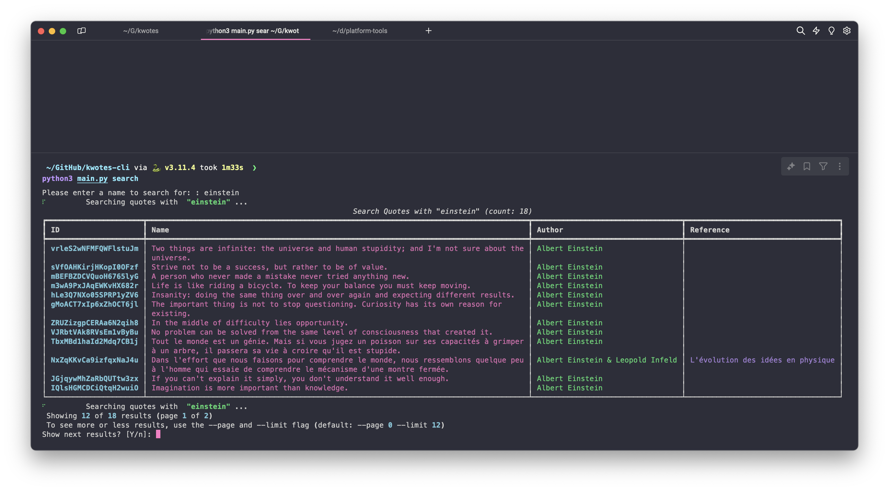

# kwotes-cli

A tiny CLI app for kwotes platform.

## Quickstart

Prerequisites: Install python 3.11+

Get an API key at https://dev.fig.style

Replace KWOTES_API_KEY = "" with an actual value.

* Clone this project: `git clone https://github.com/rootasjey/kwotes-cli.git`
* `cd kwotes-cli`

Get last recent quotes
* `python main.py recent`

Search quotes with keywords
* `python main.py search einstein`
